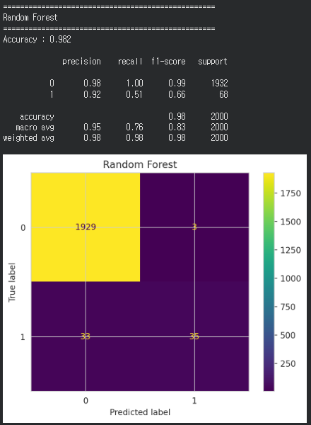
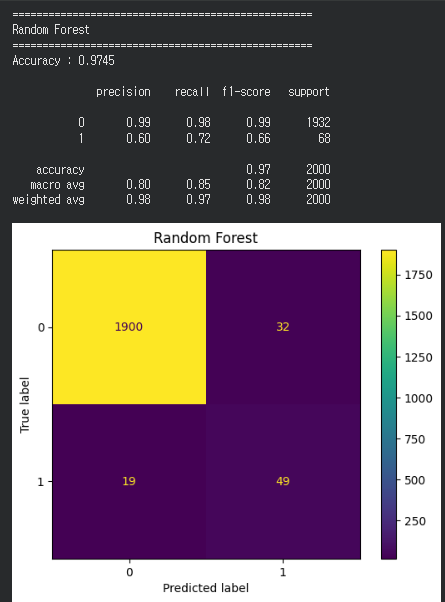
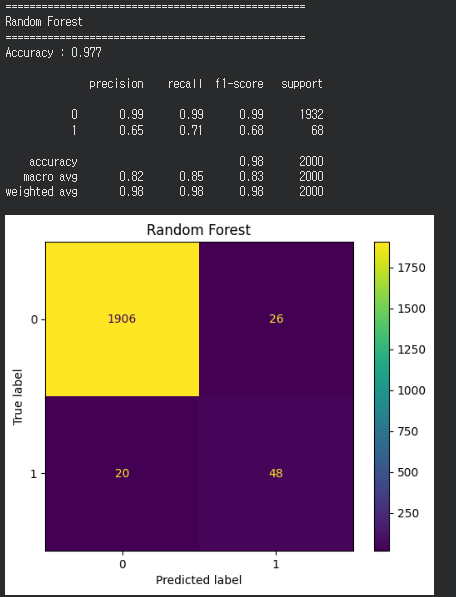
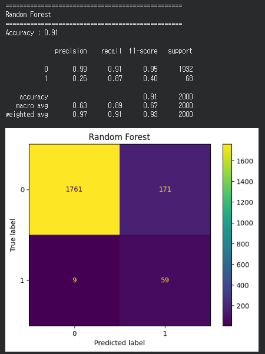
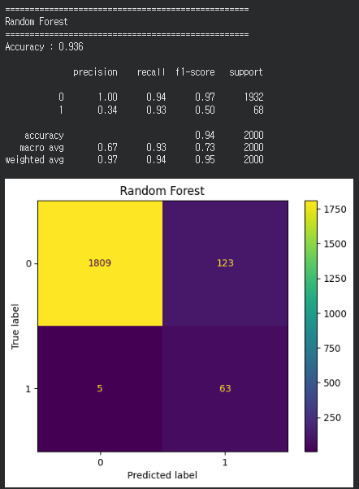

# 제목

Random Forest 모델 성능 개선 (SMOTE, Class Weight, Hyperparameter Tuning, Feature Engineering)

---

# 상세

기본 Random Forest 모델을 이용하여 AI4I Predictive Maintenance Dataset을 학습한 결과, Accuracy는 높게 나타났지만 Failure(고장) 데이터에 대한 Recall이 낮게 측정되었다.

데이터를 분석한 결과 정상 데이터와 Failure 데이터의 비율이 약 **9661 : 339**로 매우 불균형하였으며, 모델이 정상 데이터에 편향되어 학습되는 문제가 발생하였다.

Failure 탐지 성능을 향상시키기 위해 다음과 같은 순서로 성능 개선을 진행하였다.

---

## 1. SMOTE 적용

데이터 불균형 문제를 해결하기 위해 SMOTE(Synthetic Minority Over-sampling Technique)를 적용하였다.

기존 Failure 데이터를 단순 복사하는 것이 아니라 새로운 샘플을 생성하여 학습 데이터의 균형을 맞추었다.

     

---

## 2. Class Weight 조정

SMOTE 적용 이후에도 Failure 탐지 성능을 향상시키기 위해 RandomForest의 class_weight 값을 변경하며 실험을 진행하였다.

실험한 값

- balanced
- {0:1, 1:5} ✅
- {0:1, 1:8}

각 가중치별 Recall, Precision, Accuracy를 비교하여 가장 적절한 값을 탐색하였다.



---

## 3. Hyperparameter Tuning

RandomizedSearchCV를 이용하여 RandomForest의 최적 하이퍼파라미터를 탐색하였다.

탐색 항목

- n_estimators `[100, 200, 300, 500]`
- max_depth `[5, 10, 15, 20, None]`
- min_samples_split `[2, 5, 10]`
- min_samples_leaf`[1, 2, 4]`
- max_features `["sqrt", "log2"]`
- class_weight `["balanced", {0:1, 1:3}, {0:1, 1:5}, {0:1, 1:8}]`

평가 기준은 Accuracy가 아닌 Recall(scoring="recall")로 설정하여 5-Fold Cross Validation을 수행하였다.

최종 선택된 파라미터

```python
{
    "n_estimators": 500,
    "max_depth": 10,
    "min_samples_split": 10,
    "min_samples_leaf": 4,
    "max_features": "log2",
    "class_weight": {0:1, 1:8}
}
```



---

## 4. Feature Engineering

추가적인 성능 향상을 위해 기존 센서 데이터를 이용하여 새로운 파생 변수를 생성하였다.

생성한 Feature

- Power
- Temp_diff
- Power_wear
- Torque_per_RPM
- Torque_wear
- Temp_Torque
- Temp_ratio

기존 센서 데이터만 사용하는 것이 아니라 설비의 출력, 온도차, 공구 마모 등의 관계를 함께 고려할 수 있도록 Feature를 생성하였다.



---

# 결과

| 단계                  | 결과                                                                        |
| --------------------- | --------------------------------------------------------------------------- |
| 기본 Random Forest    | Accuracy는 높았지만 Failure Recall이 낮게 나타남                            |
| SMOTE 적용            | Failure Recall 향상 확인                                                    |
| Class Weight 조정     | Recall 추가 향상 및 최적 가중치 탐색                                        |
| Hyperparameter Tuning | 최적 파라미터 탐색 및 Recall 향상                                           |
| Feature Engineering   | 새로운 Feature를 생성하여 성능 비교를 진행하였으나 성능 향상은 제한적이었음 |

---

# 해결

불균형 데이터로 인해 발생한 Failure 탐지 성능 저하 문제를 해결하기 위해

- SMOTE를 통한 데이터 균형화
- Class Weight 조정
- Hyperparameter Tuning
- Feature Engineering

을 순차적으로 적용하였다.

실험 결과 Feature Engineering의 성능 향상 효과는 크지 않았으나, SMOTE와 Class Weight 조정, Hyperparameter Tuning을 통해 Failure Recall을 향상시킬 수 있었다.

최종적으로 Accuracy뿐만 아니라 Recall과 F1-score를 함께 고려하여 모델을 평가하였으며, 예지보전에서는 실제 고장을 놓치지 않는 것이 중요하므로 Recall 중심으로 모델을 개선하였다.

---

## 성능 비교

| 모델                    | Accuracy |   Precision |           Recall |    F1-score |
| ----------------------- | -------: | ----------: | ---------------: | ----------: |
| 기본 Random Forest      |     0.98 | 0.98 / 0.92 |      1.00 / 0.51 | 0.99 / 0.66 |
| + SMOTE                 |     0.97 | 0.96 / 0.60 |      0.98 / 0.72 | 0.99 / 0.66 |
| + Class Weight          |     0.97 | 0.99 / 0.65 |      0.99 / 0.71 | 0.99 / 0.68 |
| + Hyperparameter Tuning |     0.91 | 0.99 / 0.26 |      0.91 / 0.87 |  0.95 / 0.4 |
| + Feature Engineering   |     0.93 | 1.00 / 0.34 | **0.94 / 0.93** |  0.97 / 0.5 |
