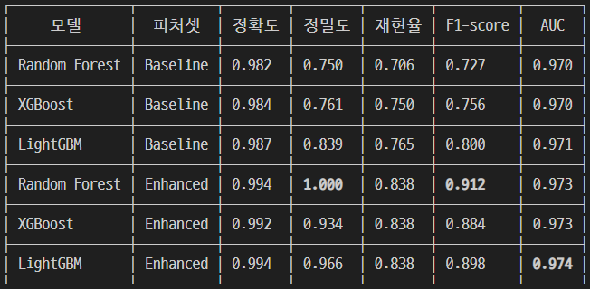

## 제목
- risk_zone_count 피처로 모델 성능 개선 및 모델 채택

## 상세
- 2차 EDA에서 "개별 변수 값보다 실제 고장 판정에 쓰이는 조합(온도차/동력/토크×마모)이 불량여부와 더 강하게 연관된다"는 인사이트를 확인. 이 조합을 임의로 만드는 대신 인터넷 검색을 통해 UCI 공식 문서에 정의된 실제 고장 판정 임계값을 확인하고, 이를 그대로 위험구간 플래그 5개로 피처화함.

  - hdf_zone: 온도차 < 8.6K AND 회전속도 < 1380rpm
  - pwf_zone: 동력 < 3500W OR 동력 > 9000W
  - osf_zone: 토크×공구마모 > Type별 임계값(L11000/M12000/H13000)
  - high_wear: 공구마모 > 200분
  - risk_zone_count: 위 4개 합산(0~4)

- RF/XGBoost/LightGBM 3종에 대해 Baseline(2차 모델링과 동일한 원본 변수 세트)과
Enhanced(위 피처 추가)로 나눠 비교.

## 결과

- risk_zone_count와 machine_failure 상관계수 0.630 — 원본 변수 중 가장 강한 torque(0.191)의 약 3배
- risk_zone_count별 실제 불량률: 0개 → 0.11% / 1개 → 27.2% / 2개 이상 → 100%
- 3개 모델 전부에서 개선 재현 → 특정 알고리즘에 대한 과적합이 아님을 확인

## 해결
- RF + Enhanced 피처셋을 최종 모델로 채택
- Baseline만 볼 때는 LightGBM이 가장 좋았으나(F1 0.800), Enhanced 적용 시
  Random Forest가 역전 — 원래 조합 규칙 탐지력이 약했던 모델이 위험구간 피처
  효과를 가장 크게 흡수한 것으로 해석