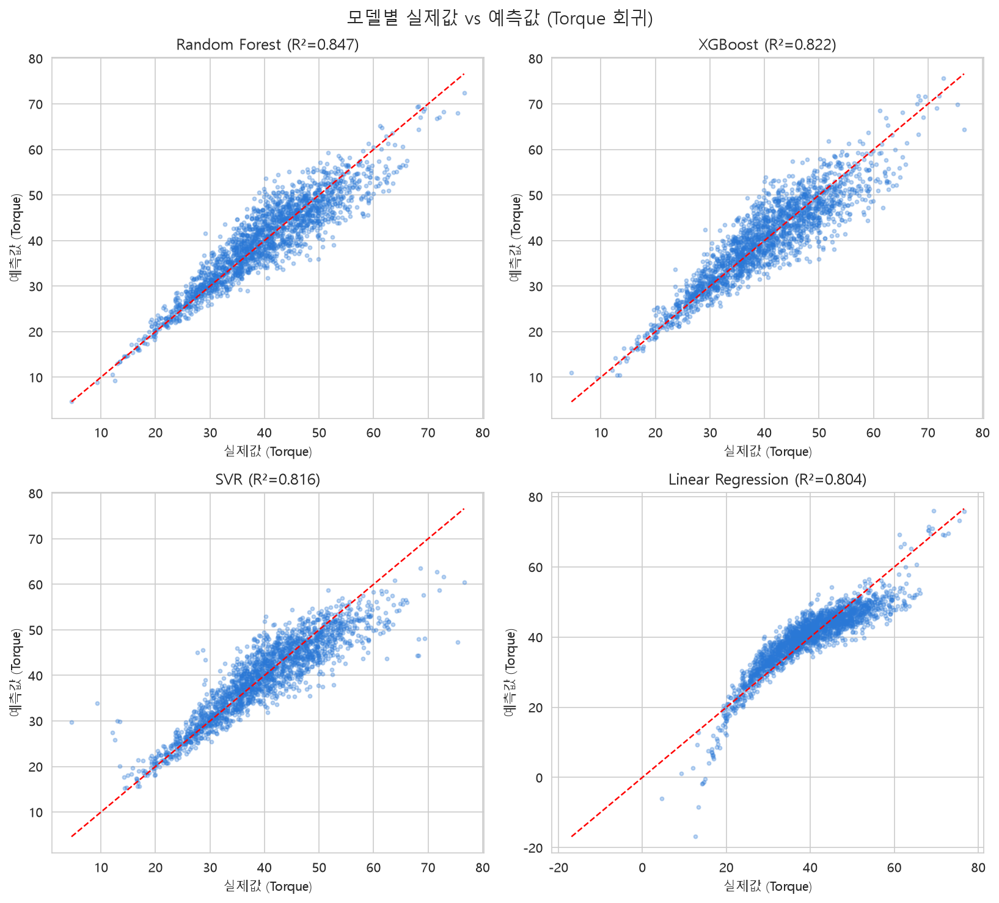
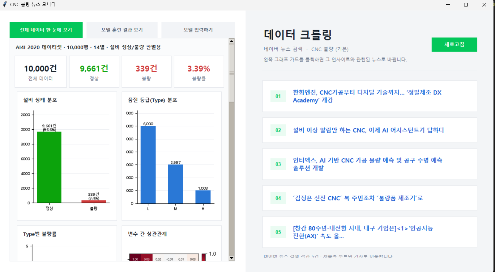
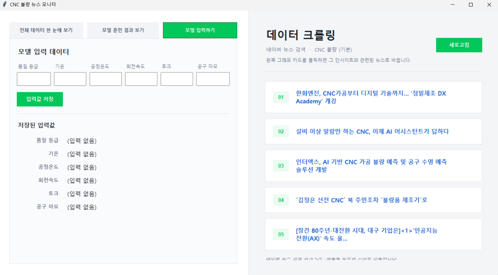

# CNC 설비 정상/불량 판별 — EDA, 모델링, UI

- [UCI AI4I 2020 Predictive Maintenance Dataset](https://archive.ics.uci.edu/dataset/601/ai4i+2020+predictive+maintenance+dataset) 기반 CNC 설비 미니 프로젝트
- **확정 주제**: `Machine failure`(설비 정상/불량) 이진분류 — 탐색 단계에서는 `Type`(품질 등급) 다중분류, `Torque`(토크) 회귀도 함께 비교해봤습니다 (아래 2장 참고)
- 원본 데이터: [`src/ai4i2020.csv`](src/ai4i2020.csv) (10,000행 x 14열)
- 결과물: EDA 노트북, 모델링 노트북 3종, 학습된 모델(`model/random_forest_enhanced.joblib`), Tkinter 데스크톱 UI(`src/UI/`)

## 목차

1. [데이터 개요](#데이터-개요)
2. [탐색적 데이터 분석 (EDA)](#1-탐색적-데이터-분석-eda)
3. [모델링 — 세 가지 예측 문제 비교](#2-모델링--세-가지-예측-문제-비교)
4. [모델 저장 & UI 연동](#3-모델-저장--ui-연동)
5. [UI 설계 — Tkinter 데스크톱 앱](#4-ui-설계--tkinter-데스크톱-앱)
6. [실행 방법](#실행-방법)
7. [트러블슈팅 & 추가 문서](#트러블슈팅--추가-문서)

## 데이터 개요

| 컬럼 | 설명 | 타입 |
| --- | --- | --- |
| UDI, Product ID | 식별자 | 정수, 문자열 |
| Type | 제품 품질 등급 (L: 저가, M: 중가, H: 고가) | 문자 |
| Air temperature [K] | 대기 온도 | 실수 |
| Process temperature [K] | 공정 온도 | 실수 |
| Rotational speed [rpm] | 회전 속도 | 정수 |
| Torque [Nm] | 토크 | 실수 |
| Tool wear [min] | 공구 사용 시간(마모도) | 정수 |
| Machine failure | 고장 여부 (타겟, 0/1) | 정수(0, 1) |
| TWF / HDF / PWF / OSF / RNF | 세부 고장 모드: 공구마모 / 방열 / 전력 / 과부하 / 랜덤 | 정수(0, 1) |

> **주의**: `Type`과 `Product ID` 값에는 `' L   '`처럼 앞뒤 공백이 섞여 있습니다. `groupby`/`countplot`/`join` 전에 반드시 `.str.strip()`으로 제거해야 합니다 — 이 README의 그래프 중 일부도 처음에는 이 공백 때문에 빈 그래프로 저장돼 있었고, 재작업하며 고쳤습니다(아래 8번 항목 참고).

## 1. 탐색적 데이터 분석 (EDA)

- 분석 코드: [`src/EDA1.ipynb`](src/EDA1.ipynb) (컬럼 선택/그룹핑 연습에 초점을 둔 2차 노트북은 [`src/EDA2.ipynb`](src/EDA2.ipynb))

### 1. 데이터 품질
- 결측치 없음, 중복행 없음

### 2. 수치형 변수 분포


- Air temperature / Process temperature / Torque: 정규분포에 근접
- Rotational speed: 오른쪽 꼬리가 긴 분포
- Tool wear: 0~253분, 비교적 고르게 분포

### 3. Type(품질 등급) 분포


- L(60%) > M(30%) > H(10%)

### 4. 타겟(Machine failure) 분포 — 클래스 불균형


- 정상 9,661건(96.6%) vs 고장 339건(**3.39%**)
- 극심한 클래스 불균형
- → 모델링 시 accuracy 대신 recall / precision / F1 / ROC-AUC 사용
- → 리샘플링(SMOTE) 또는 class_weight 조정 필요

### 5. 세부 고장 모드 (TWF, HDF, PWF, OSF, RNF)


- 발생 빈도: **HDF(방열, 115건) > OSF(과부하, 98건) > PWF(전력, 95건) > TWF(공구마모, 46건) > RNF(랜덤, 19건)**
- 대부분 세부 모드 1개만 발생, 2~3개 동시 발생 케이스도 존재
- 데이터 불일치 확인
  - `Machine failure=1`인데 세부 모드 없음: 9건
  - `Machine failure=0`인데 세부 모드 있음: 18건
  - → 라벨링 규칙(특히 RNF)이 100% 결정론적이지 않음, 전처리 시 유의

### 6. 상관관계


- `Air temperature` ↔ `Process temperature`: **+0.88** (강한 양의 상관 → 다중공선성 주의)
- `Rotational speed` ↔ `Torque`: **-0.88** (강한 음의 상관 → 일정 출력 가정 시 당연한 물리적 관계)
- `Machine failure` 상관 순위: `Torque`(0.19) > `Tool wear`(0.11) > `Air temperature`(0.08)

### 7. 고장 여부에 따른 변수 분포


- 고장 발생 시 `Torque`·`Tool wear` 대체로 높음, `Rotational speed`는 낮은 경향
- 토크-회전속도 역상관과 일치

### 8. Type(품질 등급)별 고장률


| Type | 총건수 | 고장건수 | 고장률 |
| --- | --- | --- | --- |
| L (저가) | 6,000 | 235 | 3.92% |
| M (중가) | 2,997 | 83 | 2.77% |
| H (고가) | 1,003 | 21 | 2.09% |

- 등급 낮을수록(L) 고장률 높음, 등급 높을수록(H) 고장률 낮음
- → 저가형 제품의 내구성/공차가 상대적으로 낮은 것으로 해석
- **재작업 메모**: 위 3번/8번 차트는 원래 `Type` 값의 앞뒤 공백을 제거하지 않고 `["L","M","H"]` 기준으로 그려서 막대가 하나도 안 보이는 빈 그래프로 저장돼 있었습니다. `df["Type"] = df["Type"].str.strip()`를 추가하고, 8번 차트는 추가로 `plot(kind="bar", rot=0)`(x축 라벨 회전을 꺼서 Malgun Gothic 폰트와 결합했을 때 L/M/H가 깨진 글자로 렌더링되던 문제 회피)까지 적용해 다시 생성했습니다.

## 2. 모델링 — 세 가지 예측 문제 비교

같은 데이터셋으로 세 가지 타겟(Type 다중분류 / Torque 회귀 / Machine failure 이진분류)을 각각 모델링해보고 비교한 결과, **물리적으로 실제 관계가 있는 타겟은 잘 예측되고, 관계가 약한 타겟은 아무리 모델을 바꿔도 잘 예측되지 않는다**는 일관된 패턴을 확인했습니다. 이 비교가 최종적으로 `Machine failure` 이진분류(3번 항목)를 확정 주제로 잡은 근거입니다.

### 2-1. Type(품질 등급) 다중분류 — 시도했으나 신호가 약함

- 목표: 센서값(`Air/Process temperature`, `Rotational speed`, `Torque`, `Tool wear`)과 세부 고장 모드로 `Type`(L/M/H) 예측
- 모델 4종: Random Forest, XGBoost, Logistic Regression, SVM — `class_weight="balanced"` 적용, 파생변수 4개(`Temp_diff`, `Power`, `Torque_x_ToolWear`, `Failure_mode_count`) 포함

| 모델 | 정확도 | 정밀도 | 재현율 | F1-score | AUC |
| --- | --- | --- | --- | --- | --- |
| XGBoost | 0.494 | 0.327 | 0.332 | **0.328** | 0.503 |
| Random Forest | 0.492 | 0.326 | 0.330 | 0.325 | **0.509** |
| Logistic Regression | 0.239 | 0.329 | 0.330 | 0.233 | 0.497 |
| SVM | 0.223 | 0.304 | 0.297 | 0.218 | 0.478 |


- **AUC가 4개 모델 전부 0.48~0.51로 사실상 랜덤 수준**입니다. 파생변수를 추가해도 거의 개선되지 않았습니다.
- 해석: `Type`은 가동 중 센서 측정값과 직접적인 인과관계가 없는, 제품 생산 시점에 이미 정해진 식별자성 라벨에 가깝습니다.
- (참고) 이 실험은 `classifications.ipynb`로 진행했으며, 프로젝트 주제가 `Machine failure` 이진분류로 확정된 뒤 노트북 파일 자체는 정리했습니다. 위 표/그래프는 결과 기록으로 남겨둔 것입니다.

### 2-2. Torque[Nm] 회귀 — 강한 신호 확인

- 목표: `Air/Process temperature`, `Rotational speed`, `Tool wear`, `Machine failure`/고장 모드 플래그로 `Torque [Nm]` 예측
- **주의**: `Power`나 `Torque × Tool wear`처럼 `Torque`를 직접 곱해 만드는 파생변수는 타겟 정보를 그대로 포함하므로(데이터 누수) 이 실험에서는 사용하지 않았습니다.
- 모델 4종: Random Forest, XGBoost, SVR(rbf), Linear Regression

| 모델 | R² | MAE | RMSE | MAPE(%) |
| --- | --- | --- | --- | --- |
| Random Forest | **0.847** | 2.99 | 3.89 | 7.41 |
| XGBoost | 0.822 | 3.23 | 4.19 | 8.11 |
| SVR | 0.816 | 3.08 | 4.25 | 8.02 |
| Linear Regression | 0.804 | 3.42 | 4.40 | 9.37 |



- **4개 모델 전부 R² 0.8 이상**으로 뚜렷하게 예측됩니다 — 2-1의 `Type`(AUC 0.48~0.51, 랜덤 수준)과 정반대되는 결과입니다.
- 해석: `Torque`는 `Rotational speed`와 물리적으로 강하게 얽혀 있는(EDA 6번, -0.88) 변수라서 잘 예측되고, `Type`은 그런 물리적 관계가 없어서 잘 예측되지 않습니다 — "모델을 더 좋은 걸 썼는가"보다 "타겟이 특성들과 실제로 관계가 있는가"가 예측 성능을 훨씬 크게 좌우한다는 걸 보여줍니다.
- (참고) 이 실험도 `regression.ipynb`로 진행했으며, 마찬가지로 결과만 기록으로 남기고 노트북 파일은 정리했습니다.

### 2-3. Machine failure(정상/불량) 이진분류 — 최종 채택 모델

- 대상: `Machine failure`(0=정상, 1=불량) — 이진분류, **이 프로젝트의 확정 주제**
- 목표 설정 근거: EDA에서 `Torque`/`Tool wear`와 상관관계가 확인된 타겟 → 설비진단 문제로 직결, 2-2의 회귀 실험에서도 `Torque` 자체가 물리적으로 예측 가능한 신호임을 재확인

이 주제 하나로만 노트북을 3번(`model_1.ipynb` → `model_2.ipynb` → `model_3.ipynb`) 다시 짰습니다. 세 번
다 같은 데이터·같은 타겟이지만, **접근 방식이 매번 바뀐 이유가 바로 앞 시도의 한계**이기 때문에 순서대로
보면 왜 최종적으로 지금 방식(3차)에 도달했는지 납득이 갑니다.

#### 1차 — Baseline (`src/model_1.ipynb`)

- 전처리: `Product ID` 제거, `Type` 원-핫 인코딩, `MinMaxScaler` 정규화, `SMOTE`로 소수 클래스(불량) 오버샘플링 — **파생변수 없이 원본 변수 그대로** 사용
- 모델 3종을 단순 비교: Random Forest(예측 확률 임계값을 기본 0.5 대신 0.3으로 낮춰 재현율 우선), XGBoost, LightGBM

| 모델 | 정확도 | 불량(1) 정밀도 | 불량(1) 재현율 | 불량(1) F1 |
| --- | --- | --- | --- | --- |
| Random Forest (threshold 0.3) | 0.942 | 0.35 | **0.85** | 0.50 |
| XGBoost | 0.984 | **0.91** | 0.59 | 0.71 |
| LightGBM | 0.9845 | 0.89 | 0.62 | 0.73 |

- **정확도만 보면 셋 다 94~98%로 훌륭해 보이지만, 클래스 불균형 때문에 착시입니다** — "전부 정상"이라 찍어도 96.6%가 나오는 데이터라, 진짜 봐야 할 건 불량(1) 클래스의 정밀도/재현율입니다.
- 세 모델이 **정반대 방향으로 치우쳐 있습니다**: RF는 임계값을 낮춰 재현율 0.85까지 끌어올렸지만 정밀도가 0.35로 낮아 불량 예측 10건 중 6~7건이 오탐입니다. 반대로 XGBoost/LightGBM은 정밀도는 0.9 안팎으로 높지만 재현율이 0.6 전후라 실제 불량의 40%가량을 놓칩니다.
- → **원본 변수만으로는 재현율과 정밀도를 동시에 만족시키는 모델이 없다**는 것이 1차의 결론이고, 이게 2차로 넘어가는 이유입니다.

#### 2차 — 피처 엔지니어링 & 하이퍼파라미터 튜닝 (`src/model_2.ipynb`)

- 1차의 "재현율이 낮다"는 문제를 정면으로 겨냥: 파생변수 6개(`Power`=회전속도×토크, `Temp_diff`=온도차, `Power_wear`=동력×공구마모, `Torque_per_RPM`, `Torque_wear`=토크×공구마모, `Temp_Torque`, `Temp_ratio`)를 추가하고, `RandomForestClassifier`에 `RandomizedSearchCV`(`n_iter=30`, `cv=5`, **`scoring="recall"`** — 재현율을 목적함수로 직접 최적화, `class_weight` 후보에 `{0:1,1:3}/{0:1,1:5}/{0:1,1:8}` 같은 커스텀 가중치도 포함)로 체계적 탐색
- 탐색된 최적 파라미터: `n_estimators=300, min_samples_split=5, min_samples_leaf=2, max_features="log2", max_depth=None, class_weight={0:1,1:8}` — 교차검증 재현율 **0.995**

| 모델 | 정확도 | 불량(1) 정밀도 | 불량(1) 재현율 | 불량(1) F1 |
| --- | --- | --- | --- | --- |
| 1차 RF (threshold 0.3) | 0.942 | 0.35 | 0.85 | 0.50 |
| 2차 RF (RandomizedSearchCV 튜닝) | 0.940 | 0.34 | **0.91** | 0.50 |

- 재현율은 1차 최고치(0.85)보다 더 올라 **0.91**을 달성했지만(교차검증 점수 0.995와는 차이가 큼 — 실제 테스트셋에서는 그만큼 안 나옴), **정밀도는 오히려 0.34로 더 떨어졌고 F1은 0.50으로 1차 RF와 사실상 그대로**입니다.
- → **재현율 하나만 목적함수로 튜닝하면 정밀도를 그만큼 깎아먹을 뿐, 둘의 트레이드오프 자체는 풀리지 않는다**는 것이 2차의 결론입니다. 파생변수를 늘리고 탐색을 아무리 정교하게 해도 "모델이 데이터에서 스스로 좋은 경계를 찾게 맡기는" 접근 자체의 한계로 보입니다 — 이게 3차에서 접근 방식을 통째로 바꾸는 이유입니다.

#### 3차 — 인사이트 기반 피처 엔지니어링: 위험구간(risk_zone) (`src/model_3.ipynb`, 최종 배포)

1·2차가 "모델/파라미터를 바꿔서 데이터에 숨은 경계를 더 잘 찾게 하기"였다면, 3차는 **접근을 바꿨습니다** — 모델이 스스로 규칙을 찾게 두지 않고, AI4I 2020 데이터셋 공식 문서에 이미 정의된 고장 판정 규칙(온도차·회전속도·토크×마모 임계값)을 **직접 계산해서 피처로 미리 넣어줬습니다**. 아래는 그 결과입니다.

- 코드: [`src/model_3.ipynb`](src/model_3.ipynb) (내부 markdown/이미지 파일명은 이전 이름인 `modeling2`를 그대로 씁니다)
- 상세 과정/그래프: [`docs/modeling2_binary_eda.md`](docs/modeling2_binary_eda.md)

**배경 — 클래스 불균형**


- 정상 9,661건 vs 불량 339건(3.4%), EDA와 동일한 불균형

**변수별 정상/불량 분포 비교**


- `torque`·`tool_stress`·`machanical_power`는 불량일 때 분포가 훨씬 넓게 퍼짐(정상 고장/과부하 양쪽 극단에서 발생)
- `air_temp`/`process_temp` 자체보다 `temp_diff`(공정온도−기온)가 더 잘 갈림 → HDF(방열 고장) 판정 기준이 온도 자체가 아니라 온도"차"이기 때문

**피처 엔지니어링 — 위험구간(zone) 플래그**
- 근거: UCI 공식 데이터셋 설명에 정의된 고장 발생 조건(임의 추정 아님)
- 비유: 자동차 계기판 경고등 — 특정 조건 진입 시 경고등 점등

| 피처 | 점등 조건 | 의미 |
| --- | --- | --- |
| `hdf_zone` | 온도차 < 8.6K **AND** 회전속도 < 1380rpm | 방열 고장 위험 |
| `pwf_zone` | 동력 < 3500W **OR** 동력 > 9000W | 전력 고장 위험 |
| `osf_zone` | 토크×공구마모 > Type별 임계값(L11000/M12000/H13000) | 과부하 위험 |
| `high_wear` | 공구마모 > 200분 | 공구마모 고장 임박 |
| `risk_zone_count` | 위 4개 합산(0~4) | 동시 점등 개수 |


- `risk_zone_count`별 실제 불량률: 0개 → 0.11% / 1개 → 27.2% / 2개 이상 → 100%
- → 경고등 2개 이상 동시 점등 시 사실상 고장 확정


- `risk_zone_count`가 원본 변수를 통틀어 `machine_failure`와 가장 강한 상관관계를 보이고, `hdf_zone`/`osf_zone`/`pwf_zone`도 원본 `torque`/`tool_wear`보다 한참 앞섬

**모델 비교 — Baseline(원본 변수만) vs Enhanced(위험구간 추가)**
- 검증 모델 3종: Random Forest, XGBoost, LightGBM (특정 모델만의 우연 여부 확인 목적)

| 모델 | 피처셋 | 정확도 | 정밀도 | 재현율 | F1-score | AUC |
| --- | --- | --- | --- | --- | --- | --- |
| Random Forest | Baseline | 0.982 | 0.750 | 0.706 | 0.727 | 0.970 |
| XGBoost | Baseline | 0.984 | 0.761 | 0.750 | 0.756 | 0.970 |
| LightGBM | Baseline | 0.987 | 0.839 | 0.765 | 0.800 | 0.971 |
| **Random Forest** | **Enhanced** | **0.994** | **1.000** | 0.838 | **0.912** | 0.973 |
| XGBoost | Enhanced | 0.992 | 0.934 | 0.838 | 0.884 | 0.973 |
| LightGBM | Enhanced | 0.994 | 0.966 | 0.838 | 0.898 | **0.974** |


**해석**
- 3개 모델 전부 개선 → 특정 모델 한정 효과 아닌 일반적 효과 (RF +0.185, XGBoost +0.128, LightGBM +0.098)
- Baseline 기준 LightGBM 최고 → 그래디언트 부스팅 계열이 조합 규칙을 어느 정도 자체 탐지
- Random Forest 개선폭 최대 → 원래 조합 규칙 탐지력이 가장 약했던 모델이 위험구간 피처 효과를 가장 크게 흡수
- AUC는 6개 조합 전부 0.970~0.974로 거의 동일 → 위험구간 피처는 "순위 매기기(AUC)"보다 "정확한 경계 판별(precision/recall/F1)"에 기여
- **최종 배포 모델은 Enhanced 피처셋의 Random Forest**(F1 0.912, 정밀도 1.000) — 아래 3번 항목 참고

**1차 → 2차 → 3차 한눈에 비교** (불량(1) 클래스 기준, 매번 가장 나았던 조합)

| 단계 | 접근 | 정밀도 | 재현율 | F1 |
| --- | --- | --- | --- | --- |
| 1차 | Baseline, 임계값 조정 (RF) | 0.35 | 0.85 | 0.50 |
| 2차 | 피처 엔지니어링 + `RandomizedSearchCV` 재현율 튜닝 (RF) | 0.34 | 0.91 | 0.50 |
| 3차 | 위험구간(risk_zone) 피처 + Random Forest | **1.000** | 0.838 | **0.912** |

1차·2차는 모델/파라미터를 아무리 바꿔도 F1이 0.50 언저리에 머물렀지만, 3차에서 **도메인 지식을 피처로
직접 주입하자 F1이 0.912까지 뛰었습니다** — "모델을 더 잘 튜닝하는 것"보다 "데이터에 이미 있는 물리적
규칙을 모델이 알아채기 쉬운 형태로 바꿔주는 것"이 훨씬 효과적이었다는 뜻입니다.

**핵심 요약**
1. 원본 변수 절대값보다 "위험 신호 동시 발생 개수"가 훨씬 강한 신호
2. 근거 기반 피처 엔지니어링 — 데이터셋 공식 문서의 고장 조건을 그대로 피처화
3. 클래스 불균형 문제는 AUC만으로 판단 금지 → F1/precision/recall 함께 확인 필요
4. 파라미터 튜닝(2차)은 재현율/정밀도 중 하나를 다른 하나와 맞바꿀 뿐 트레이드오프 자체를 깨지 못했지만, 피처 엔지니어링(3차)은 그 트레이드오프 자체를 완화했다 — 모델링 순서상 "더 정교한 튜닝"보다 "더 좋은 피처"를 먼저 의심해볼 가치가 있다는 교훈

## 3. 모델 저장 & UI 연동

`src/model_3.ipynb`의 마지막 셀("6. 모델 저장")이 위 6가지 조합 중 최종 선택한 **Random Forest(Enhanced)** 모델을 `model/random_forest_enhanced.joblib`에 저장합니다.

```python
joblib.dump(
    {
        "model": models["Random Forest"],       # Enhanced 피처셋으로 학습된 RF
        "features": enhanced_cols,               # 예측 시 필요한 15개 피처 순서
        "metrics": eval_results["Random Forest (Enhanced)"],  # 정확도/정밀도/재현율/F1/AUC
    },
    "../model/random_forest_enhanced.joblib",
)
```

모델·피처 순서·평가지표를 **하나의 파일에 같이 저장**해서, UI(`src/UI/model_predictor.py`)가 숫자를 하드코딩하지 않고 이 파일을 단일 출처(single source of truth)로 읽어가게 설계했습니다. 자세한 UI 연동 방식은 바로 다음 장 참고.

## 4. UI 설계 — Tkinter 데스크톱 앱

### 4-1. 기획 과정 — 목업에서 실제 구현까지

처음에는 Streamlit 스타일의 다크 테마 와이어프레임으로 UI를 기획했습니다.


- ① 데이터 수집 & 관리 화면: 크롤링 설정(검색어/수집 주기) + 수집 내역 테이블
- ② 모델 예측 & 결과 화면: 모델 선택 + 예측 입력 폼 + 확률 막대그래프

실제 구현은 Streamlit이 아니라 **Tkinter 데스크톱 앱**으로 진행했고, 레이아웃도 좌/우 2분할(왼쪽: 데이터/모델, 오른쪽: 뉴스 크롤링)로 바뀌었습니다. 아래 4-4 스크린샷이 최종 구현 결과입니다.

### 4-2. 아키텍처 — `src/UI/`

`main.py`는 위젯 조립만 담당하고, "무엇을 그릴지"/"무엇을 수집할지"/"무엇을 예측할지"는 각각 별도 모듈에 위임합니다. 세 모듈 모두 Tkinter를 몰라도 되게(=import조차 하지 않게) 설계해서, 나중에 다른 UI(웹 등)로 갈아끼워도 재사용할 수 있습니다.

| 모듈 | 역할 |
| --- | --- |
| `main.py` | Tkinter 위젯 조립, 좌/우 패널 라우팅, 배경 스레드 관리 |
| `visualizer.py` | `ai4i2020.csv` → matplotlib `Figure`/`Axes` (그래프 12종) |
| `crawler.py` | 검색어 → 네이버 뉴스 HTML → 기사 목록 파싱 |
| `model_predictor.py` | 저장된 모델(`model/random_forest_enhanced.joblib`) 로드, 입력값 → 예측/지표 |

### 4-3. 왼쪽 패널 — 데이터/모델 (nav 탭 3개)

**① 전체 데이터 한 눈에 보기**



- 요약 카드 4개(전체/정상/불량/불량률) + `visualizer.chart_specs()`가 정의한 그래프 12개를 2열 카드 그리드로 표시
- 그래프 카드를 클릭하면 설명 툴팁이 뜨고, **동시에 오른쪽 뉴스 패널이 그 차트의 인사이트와 관련된 키워드로 재검색**됩니다 (예: "세부 고장 모드별 발생 건수" 카드 → `"CNC 방열 고장"` 재검색) — "크롤링이 EDA 결과를 실제 업계 뉴스로 뒷받침/검증해 보는" 용도로 설계했습니다.

**② 모델 훈련 결과 보기**

- `model_predictor.get_metrics()`로 배포된 모델(Random Forest, Enhanced)의 정확도/정밀도/재현율/F1-score/AUC를 카드 5개로 표시
- `model_3.ipynb`가 만들어 둔 비교 그래프 2장(모델 3종×피처셋 비교, 혼동행렬 비교)을 그대로 이미지로 보여줌
- 숫자는 이 화면이나 코드에 하드코딩하지 않고, `model/random_forest_enhanced.joblib`에 같이 저장된 `metrics`를 그대로 읽어옴(3장 참고)

**③ 모델 입력하기**



> 위 스크린샷은 입력 폼 레이아웃 확정 시점에 찍은 것이라 아직 예측 결과 영역이 비어 있습니다. 실제로는 "입력값 저장"을 누르면 `model_predictor.predict(values)`가 실행되어, 저장된 값 아래에 **정상/불량 예측 결과와 불량 확률**이 초록/빨강 색으로 표시됩니다.

- 품질 등급(Type)/기온/공정온도/회전속도/토크/공구마모 6개 입력칸 → "입력값 저장" 클릭 시:
  1. `model_predictor.build_feature_row()`가 6개 입력을 모델이 실제 학습한 15개 피처(위험구간 zone 파생변수 포함, 2-3장 로직과 동일)로 변환
  2. `model.predict()`/`predict_proba()`로 정상/불량 + 불량 확률 계산
  3. 빈 값/숫자 아님/Type이 L·M·H가 아닌 경우는 에러 메시지로 안내
- 예측은 크롤링과 달리 네트워크 지연이 없어 별도 스레드 없이 버튼 클릭 시 동기 실행

### 4-4. 오른쪽 패널 — 데이터 크롤링

왼쪽 그래프 카드의 인사이트를 네이버 뉴스로 다시 검색해서, EDA 결과가 실제 업계 뉴스와 같은 이야기를 하는지 확인하는 패널입니다.


- `crawler.DataCrawler`: `collect()`(HTML 요청) → `parse()`(기사 제목/URL 추출) → `fetch_news_items()`(편의 메서드)
- 그래프 카드를 클릭할 때마다 배경 스레드로 재크롤링합니다. **빠르게 여러 카드를 연달아 클릭하면 요청이 여러 개 동시에 진행될 수 있는데**, 요청마다 증가하는 `request_id`를 매겨 "가장 최신 요청의 결과만" 화면에 반영하는 가드(`_apply_if_current`)로 레이스 컨디션을 방지합니다 (`docs/troubleshooting.md`, `docs/issue1.md` 참고)
- 기사 제목 클릭 시 Chrome을 우선 찾아 열고, 없으면 기본 브라우저로 대체
- 위 다이어그램의 "④-2 정적 HTML 리포트에 삽입(`classification_report.html`)" 경로는 이후 정리 과정에서 해당 산출물이 저장소에서 제거되어, 현재는 "④-1 Tkinter 오른쪽 패널 실시간 표시" 경로만 유효합니다.

## 실행 방법

```bash
# 환경 설정 (저장소에 .venv/가 이미 있음; 없다면 python -m venv .venv로 생성)
# 주의: pip가 PATH상 Anaconda 것을 먼저 찾아 .venv가 아닌 곳에 설치될 수 있으니
# (docs/troubleshooting.md 참고) 반드시 .venv의 python -m pip로 설치할 것
./.venv/Scripts/python -m pip install -r requirements.txt

# 노트북 실행용 Jupyter 커널 등록 (최초 1회만)
./.venv/Scripts/python -m ipykernel install --user --name cnc-venv --display-name "Python (.venv - CNC project)"

# EDA 노트북 재실행 (저장소 루트의 images/eda_*.png를 재생성함)
# 주의: jupyter nbconvert --execute를 직접 쓰지 말 것 — 이 PC의 conda 자동 초기화 때문에 엉뚱한
# 인터프리터로 조용히 샐 수 있다(docs/troubleshooting.md 참고). 대신 아래처럼 scripts/run_notebook.py
# 를 쓰면 항상 .venv로 실행됨이 보장된다.
./.venv/Scripts/python scripts/run_notebook.py src/EDA1.ipynb

# 정상/불량 이진분류 노트북 재실행 (images/modeling2_*.png와
# model/random_forest_enhanced.joblib을 재생성함 — UI가 이 joblib 파일을 그대로 불러 씀)
./.venv/Scripts/python scripts/run_notebook.py src/model_3.ipynb

# Tkinter 앱 실행 (저장소 루트에서 실행. 네이버 뉴스 크롤링을 위해 인터넷 연결 필요.
# "모델 훈련 결과 보기"/"모델 입력하기" 탭을 쓰려면 위 model_3.ipynb를 먼저 한 번 실행해야 함)
./.venv/Scripts/python src/UI/main.py
```

## 트러블슈팅 & 추가 문서

- [`docs/troubleshooting.md`](docs/troubleshooting.md) — 진행형 트러블슈팅 기록(발생 단계/원인/해결 방법/예방 대책)
- [`docs/issue1.md`](docs/issue1.md) — 그래프 카드 연타 시 뉴스 검색 결과가 어긋나던 레이스 컨디션 이슈
- [`docs/issue2.md`](docs/issue2.md) — XGBoost가 컬럼명의 대괄호(`[`, `]`)를 거부하던 이슈
- [`docs/modeling2_binary_eda.md`](docs/modeling2_binary_eda.md) — `Machine failure` 이진분류 상세 과정
- [`docs/1차.md`](docs/1차.md) / [`docs/2차.md`](docs/2차.md) / [`docs/3차.md`](docs/3차.md) — 단계별 진행 보고서
