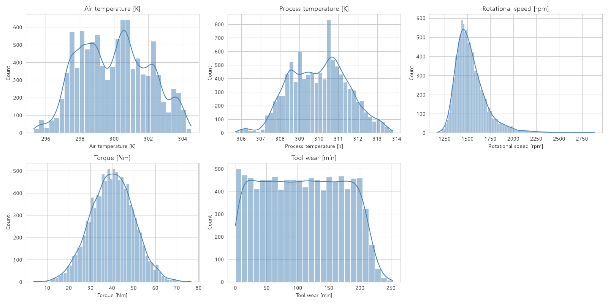
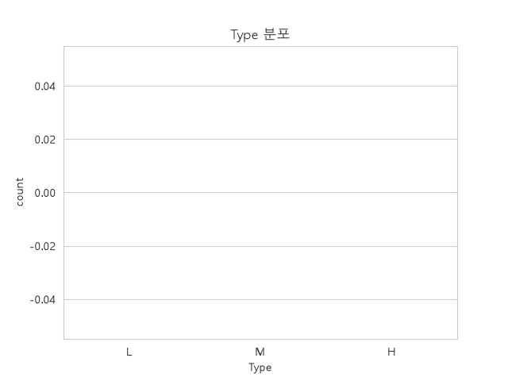
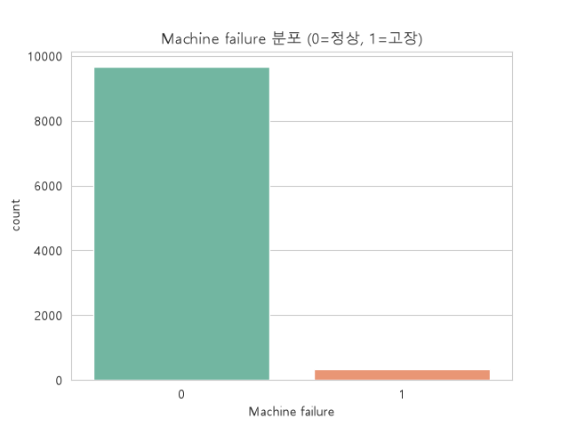
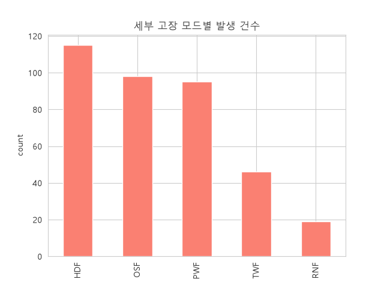
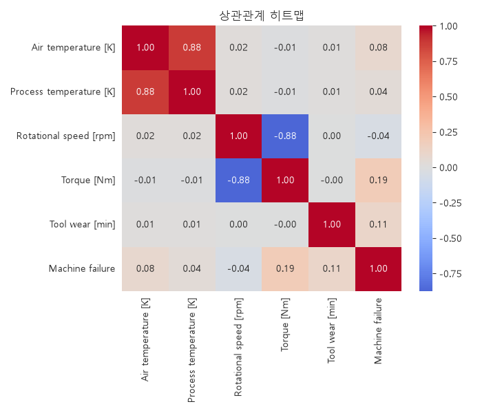
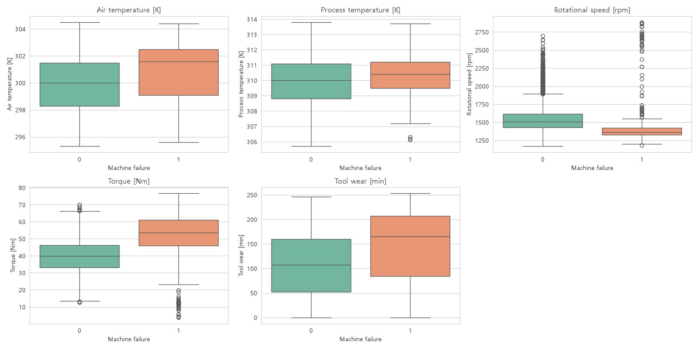
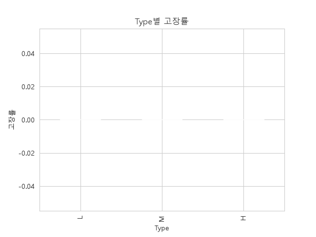
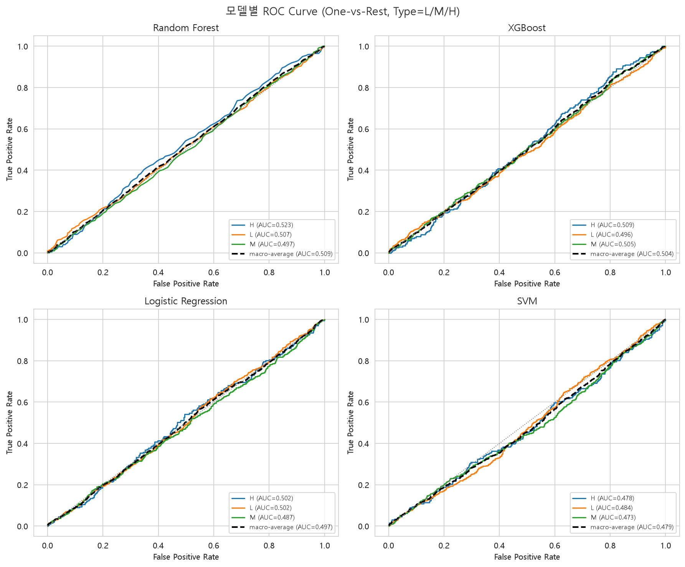
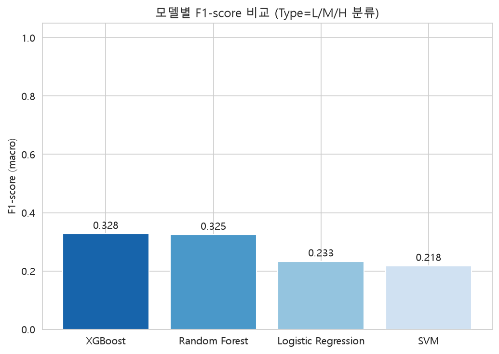

# AI4I 2020 Predictive Maintenance Dataset - EDA

[UCI AI4I 2020 Predictive Maintenance Dataset](https://archive.ics.uci.edu/dataset/601/ai4i+2020+predictive+maintenance+dataset)을 활용한 탐색적 데이터 분석(EDA) 프로젝트입니다.

- 분석 코드: [`src/EDA.ipynb`](src/EDA.ipynb)
- 원본 데이터: [`src/ai4i2020.csv`](src/ai4i2020.csv) (10,000행 x 14열)

## 데이터 개요

| 컬럼 | 설명 |
| --- | --- |
| UDI, Product ID | 식별자 |
| Type | 제품 품질 등급 (L: 저가, M: 중가, H: 고가) |
| Air temperature [K] | 대기 온도 |
| Process temperature [K] | 공정 온도 |
| Rotational speed [rpm] | 회전 속도 |
| Torque [Nm] | 토크 |
| Tool wear [min] | 공구 사용 시간(마모도) |
| Machine failure | 고장 여부 (타겟, 0/1) |
| TWF / HDF / PWF / OSF / RNF | 세부 고장 모드: 공구마모 / 방열 / 전력 / 과부하 / 랜덤 |

## 주요 분석 결과

### 1. 데이터 품질
- **결측치 없음, 중복행 없음** — 전처리 부담이 적은 깨끗한 데이터셋.

### 2. 수치형 변수 분포


- `Air temperature`, `Process temperature`, `Torque`는 정규분포에 가까움
- `Rotational speed`는 오른쪽 꼬리가 긴 분포
- `Tool wear`는 0~253분 사이에서 비교적 고르게 분포

### 3. Type(품질 등급) 분포


L(60%) > M(30%) > H(10%) 순으로 구성.

### 4. 타겟(Machine failure) 분포 — 클래스 불균형


- 정상 9,661건(96.6%) vs 고장 339건(**3.39%**)
- **극심한 클래스 불균형** → 모델링 시 accuracy 대신 recall/precision/F1/ROC-AUC 사용, 리샘플링(SMOTE 등)이나 class_weight 조정 필요

### 5. 세부 고장 모드 (TWF, HDF, PWF, OSF, RNF)


발생 빈도: **HDF(방열, 115건) > OSF(과부하, 98건) > PWF(전력, 95건) > TWF(공구마모, 46건) > RNF(랜덤, 19건)**

- 대부분 세부 모드가 1개만 발생하지만 2~3개가 동시에 발생하는 행도 존재
- **데이터 불일치**: `Machine failure=1`인데 세부 모드가 전혀 없는 행 9건, `Machine failure=0`인데 세부 모드 플래그가 있는 행 18건 → 원 데이터셋 라벨링 규칙(특히 RNF)이 100% 결정론적이지 않음, 전처리 시 유의

### 6. 상관관계


- `Air temperature` ↔ `Process temperature`: **+0.88** (강한 양의 상관, 다중공선성 주의)
- `Rotational speed` ↔ `Torque`: **-0.88** (강한 음의 상관, 일정 출력 가정 시 당연한 물리적 관계)
- `Machine failure`와 상관이 가장 높은 변수: `Torque`(0.19) > `Tool wear`(0.11) > `Air temperature`(0.08)

### 7. 고장 여부에 따른 변수 분포


고장 발생 시 `Torque`와 `Tool wear`가 대체로 더 높고, `Rotational speed`는 더 낮은 경향 (토크-회전속도 역상관과 일치).

### 8. Type(품질 등급)별 고장률


| Type | 총건수 | 고장건수 | 고장률 |
| --- | --- | --- | --- |
| L (저가) | 6,000 | 235 | 3.92% |
| M (중가) | 2,997 | 83 | 2.77% |
| H (고가) | 1,003 | 21 | 2.09% |

품질 등급이 낮을수록(L) 고장률이 높고, 등급이 높을수록(H) 고장률이 낮음 — 저가형 제품의 내구성/공차가 상대적으로 낮은 것으로 해석.

## 결론 및 시사점

1. 결측치/중복이 없어 전처리 부담이 적음
2. 클래스 불균형이 심해 예측 모델링 시 recall 중심 평가와 리샘플링 전략이 필요
3. `Air/Process temperature`, `Rotational speed/Torque` 간 다중공선성이 강해 선형모델 사용 시 변수 선택 또는 PCA 등 차원축소 고려
4. 고장 예측에 가장 유용한 변수는 `Torque`, `Tool wear`, `Air temperature`
5. 세부 고장 모드와 최종 라벨(`Machine failure`) 간 일부 불일치가 있어 라벨 정제가 필요할 수 있음
6. 제품 품질 등급(`Type`)이 낮을수록 고장 위험이 높음 — 등급별 예측 모델 분리 또는 파생 피처로 활용 가능

## Type(품질 등급) 분류 모델 비교

`Type`(L/M/H)을 센서값·고장 정보로 예측하는 분류 모델 4종(Random Forest, XGBoost, Logistic Regression,
SVM)을 학습·비교한 노트북: [`src/classifications.ipynb`](src/classifications.ipynb)

센서값 원본 특성에 더해 물리적으로 그럴듯한 파생변수 4개(`Temp_diff`, `Power`, `Torque_x_ToolWear`,
`Failure_mode_count`)도 만들어 같이 넣어봤다. F1-score(macro) 기준 XGBoost(0.328) > Random
Forest(0.325) > Logistic Regression(0.233) > SVM(0.218)였고, AUC(macro, OvR)는 전 모델이 0.48~0.51로
파생변수를 넣기 전과 거의 같은 수준(사실상 랜덤)이었다. 즉 특성을 더 정교하게 만들어도 `Type`을
유의미하게 예측하지 못한다 — `Type`은 가동 중 측정값과 직접적 인과관계가 없는 식별자성 라벨에 가깝다는
뜻으로 해석된다. 다만 Random Forest 특성 중요도에서는 `Power`/`Torque_x_ToolWear`가 원본 변수 각각보다
오히려 더 중요하게 나와, 모델이 원본보다 파생변수 쪽에서 조금 더 많은 정보를 뽑아내긴 했다(그래도
전체 성능을 끌어올릴 정도는 아님).




## 실행 방법

```bash
pip install pandas numpy matplotlib seaborn jupyter scikit-learn xgboost
jupyter nbconvert --to notebook --execute --inplace src/EDA.ipynb
jupyter nbconvert --to notebook --execute --inplace src/classifications.ipynb
```
