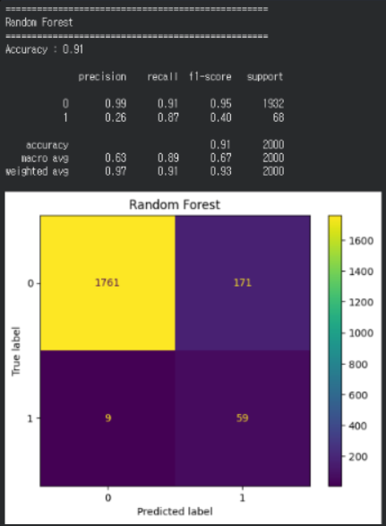
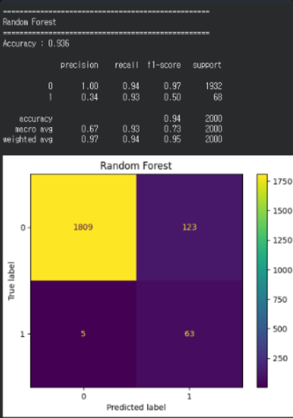
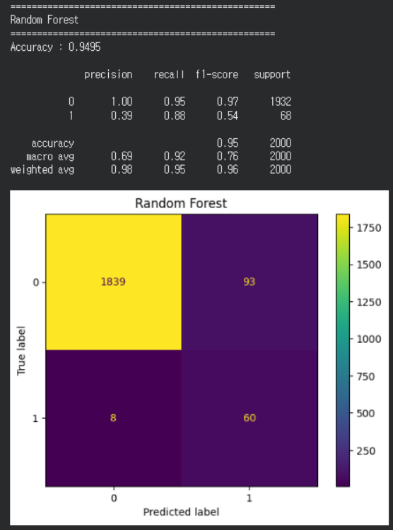

# 제목

Random Forest 성능 개선을 위한 Hyperparameter Tuning 및 Feature Engineering 비교

---

# 상세

Random Forest 모델의 Failure 탐지 성능을 향상시키기 위해 Hyperparameter Tuning과 Feature Engineering을 각각 적용하고, 두 기법을 함께 적용하여 성능을 비교하였다.

### 1. Hyperparameter Tuning

RandomizedSearchCV를 이용하여 RandomForest의 최적 하이퍼파라미터를 탐색하였다.

탐색 항목

- n_estimators `[100, 200, 300, 500]`
- max_depth `[5, 10, 15, 20, None]`
- min_samples_split `[2, 5, 10]`
- min_samples_leaf`[1, 2, 4]`
- max_features `["sqrt", "log2"]`
- class_weight `["balanced", {0:1, 1:3}, {0:1, 1:5}, {0:1, 1:8}]`
- 

최적의 파라미터를 적용한 모델을 생성하여 성능을 확인하였다.

최종 선택된 파라미터

```python
{
    "n_estimators": 500,
    "max_depth": 10,
    "min_samples_split": 10,
    "min_samples_leaf": 4,
    "max_features": "log2",
    "class_weight": {0:1, 1:8}
}
```



---

### 2. Feature Engineering

기존 센서 데이터를 이용하여 설비의 상태를 조금 더 잘 표현할 수 있도록 파생 변수를 생성하였다.

기존 Feature 간의 관계를 반영하여 모델이 고장 패턴을 더 효과적으로 학습할 수 있을 것으로 기대하였다.

생성한 Feature

- Power
- Temp_diff
- Power_wear
- Torque_per_RPM
- Torque_wear
- Temp_Torque
- Temp_ratio

새로운 Feature를 추가한 뒤 Random Forest를 다시 학습하여 성능을 비교하였다.



---

### 3. Feature Engineering + Hyperparameter Tuning

생성한 Feature를 포함한 데이터셋에 Hyperparameter Tuning을 다시 적용하여 성능 향상 여부를 확인하였다.

Feature Engineering과 Hyperparameter Tuning을 동시에 적용하였을 때 기존 모델 대비 얼마나 성능이 향상되는지 비교하였다.



---

---

# 결과

세 가지 실험 결과를 비교하였다.

| 모델                     |       Accuracy |      Precision |         Recall |       F1-score |
| ------------------------ | -------------: | -------------: | -------------: | -------------: |
| Hyperparameter Tuning    |          0.910 |           0.26 |           0.87 |           0.40 |
| Feature Engineering      |          0.936 |           0.34 | **0.93** |           0.50 |
| Feature + Hyperparameter | **0.94** | **0.39** |           0.88 | **0.54** |

성능 분석

- Hyperparameter Tuning만 적용한 모델은 Accuracy와 Precision이 가장 낮았으며, 전체적인 예측 성능이 부족하였다.
- Feature Engineering을 적용한 모델은 Accuracy와 Recall이 크게 향상되었으며, 기존 센서 데이터보다 설비의 상태를 효과적으로 표현할 수 있음을 확인하였다.
- Feature Engineering 이후 Hyperparameter Tuning을 추가 적용한 결과 Accuracy는 0.940, Precision은 0.39, F1-score는 0.54로 가장 높은 성능을 보였다.
- Recall은 0.93에서 0.88로 소폭 감소하였지만, Precision과 F1-score가 향상되어 고장을 예측하는 신뢰도가 높아졌으며 모델의 전반적인 성능 균형이 개선되었다.
- 따라서 현재 데이터셋에서는 Feature Engineering과 Hyperparameter Tuning을 함께 적용한 모델이 가장 우수한 성능을 보이는 것으로 판단하였다.

---

# 해결

Random Forest 모델의 Failure 탐지 성능을 향상시키기 위해 Hyperparameter Tuning과 Feature Engineering을 각각 적용하고, 두 기법을 함께 적용하여 성능을 비교하였다.

실험 결과 Feature Engineering만 적용한 모델은 Recall이 가장 높았으며, Hyperparameter Tuning을 추가 적용한 모델은 Accuracy, Precision, F1-score가 가장 우수한 성능을 나타냈다.

특히 Hyperparameter Tuning을 통해 모델의 예측 기준을 최적화하여 정상 데이터를 고장으로 잘못 예측하는 비율을 줄이고, 전체적인 예측 성능의 균형을 향상시킬 수 있었다.

Accuracy와 Precision, F1-score를 종합적으로 고려하여 **Feature Engineering과 Hyperparameter Tuning을 함께 적용한 Random Forest 모델을 선정하였다.**
