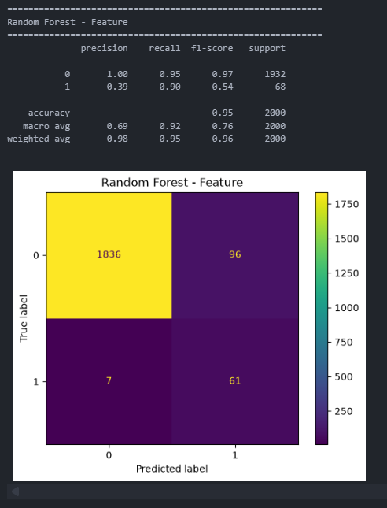
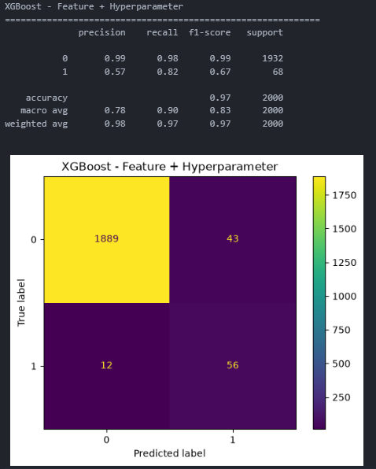
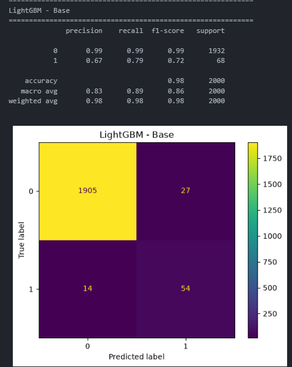

# 제목

Random Forest, XGBoost, LightGBM 모델의 성능 개선을 위한 Hyperparameter Tuning 및 Feature Engineering 비교

---

# 상세

불균형 데이터셋에서 Machine Failure 예측 성능을 향상시키기 위해 Random Forest, XGBoost, LightGBM 모델을 대상으로 성능 개선 실험을 진행하였다.

모든 모델은 동일한 전처리 과정을 적용하여 비교하였으며, 실험은 다음과 같은 순서로 수행하였다.

1. Base Model
2. Hyperparameter Tuning
3. Feature Engineering
4. Feature Engineering + Hyperparameter Tuning

전처리 과정은 다음과 같다.

- Product ID 제거
- Type One-Hot Encoding
- Train/Test Split (8:2)
- MinMax Scaling
- SMOTE 적용

---

## Hyperparameter Tuning

RandomizedSearchCV를 이용하여 Recall 기준으로 최적의 하이퍼파라미터를 탐색하였다.

사용한 탐색 파라미터는 다음과 같다.

```python
param_dist = {

    "n_estimators": [100, 200, 300, 500],

    "max_depth": [5, 10, 15, 20, None],

    "min_samples_split": [2, 5, 10],

    "min_samples_leaf": [1, 2, 4],

    "max_features": ["sqrt", "log2"],

    "class_weight": [
        "balanced",
        {0:1,1:3},
        {0:1,1:5},
        {0:1,1:8}
    ]
}
```

5-Fold Cross Validation을 수행하여 최적의 모델을 선택하였다.

---

## Feature Engineering

기존 센서 데이터를 이용하여 다음과 같은 파생 변수를 생성하였다.

- Power
- Temp_diff
- Power_wear
- Torque_per_RPM
- Torque_wear
- Temp_Torque
- Temp_ratio

생성된 Feature를 이용하여 모델을 다시 학습하고 기존 모델과 성능을 비교하였다.

---

# 결과

## 1. Random Forest

| Model                    |       Accuracy |      Precision |         Recall |       F1-score |
| ------------------------ | -------------: | -------------: | -------------: | -------------: |
| Base                     |           0.94 |           0.35 |           0.85 |           0.50 |
| Hyperparameter           |           0.85 |           0.18 | **0.95** |           0.30 |
| Feature                  | **0.94** | **0.38** |           0.89 | **0.54** |
| Feature + Hyperparameter |           0.88 |           0.22 | **0.95** |           0.35 |

**Best Model : Feature Engineering**

### 📷 Confusion Matrix (Feature Model)



### 성능 분석

- Hyperparameter Tuning은 Recall은 크게 증가했지만 Precision이 크게 감소하여 F1-score가 오히려 낮아졌다.
- Feature Engineering은 Precision과 Recall의 균형이 가장 우수하여 F1-score가 가장 높게 나타났다.
- 현재 데이터셋에서는 Feature Engineering의 효과가 Hyperparameter Tuning보다 크게 나타났다.

---

## 2. XGBoost

| Model                    |       Accuracy |      Precision |         Recall |       F1-score |
| ------------------------ | -------------: | -------------: | -------------: | -------------: |
| Base                     |           0.95 |           0.36 |           0.85 |           0.51 |
| Hyperparameter           |           0.97 |           0.53 |           0.79 |           0.64 |
| Feature                  |           0.97 |           0.48 | **0.88** |           0.62 |
| Feature + Hyperparameter | **0.98** | **0.57** |           0.82 | **0.67** |

**Best Model : Feature + Hyperparameter**

### 📷 Confusion Matrix (Feature + Hyperparameter)



### 성능 분석

- Hyperparameter Tuning만 적용해도 Base 모델보다 Precision과 F1-score가 크게 향상되었다.
- Feature Engineering을 함께 적용했을 때 Accuracy와 Precision, F1-score가 가장 우수하였다.
- Recall은 Feature 모델이 가장 높았지만 전체적인 균형은 Feature + Hyperparameter 모델이 가장 뛰어났다.

---

## 3. LightGBM

| Model                    |       Accuracy |      Precision | Recall |       F1-score |
| ------------------------ | -------------: | -------------: | -----: | -------------: |
| Base                     | **0.98** | **0.67** |   0.79 | **0.72** |
| Hyperparameter           |           0.98 |           0.61 |   0.79 |           0.69 |
| Feature                  | **0.98** | **0.67** |   0.79 | **0.72** |
| Feature + Hyperparameter |           0.98 |           0.61 |   0.79 |           0.69 |

**Best Model : Base / Feature**

### 📷 Confusion Matrix (Base Model)



# 성능 비교

세 가지 모델(Random Forest, XGBoost, LightGBM)에 대해 Base Model, Hyperparameter Tuning, Feature Engineering, Feature Engineering + Hyperparameter Tuning을 적용하여 성능을 비교하였다.

| 모델          | Best 실험                |       Accuracy |      Precision | Recall |       F1-score |
| ------------- | ------------------------ | -------------: | -------------: | -----: | -------------: |
| Random Forest | Feature Engineering      |           0.95 |           0.39 |   0.90 |           0.54 |
| XGBoost       | Feature + Hyperparameter |           0.97 |           0.57 |   0.82 |           0.67 |
| LightGBM      | Base Model               | **0.98** | **0.67** |   0.79 | **0.73** |

### 성능 분석

- **Random Forest**는 Feature Engineering 적용 시 가장 높은 F1-score(0.542)를 기록하였다. 생성한 파생 변수를 통해 모델이 설비 상태를 보다 효과적으로 학습한 것으로 판단된다.
- **XGBoost**는 Feature Engineering과 Hyperparameter Tuning을 함께 적용했을 때 Accuracy(0.973), Precision(0.566), F1-score(0.671)가 가장 높게 나타났다. 튜닝과 Feature Engineering을 함께 적용하는 것이 성능 향상에 효과적이었다.
- **LightGBM**은 Base 모델만으로도 Accuracy(0.980), Precision(0.667), F1-score(0.725)로 가장 높은 성능을 보였다. Feature Engineering과 Hyperparameter Tuning을 추가 적용하였으나 성능 향상은 거의 없었으며, 오히려 일부 지표는 소폭 감소하였다.

전체적으로 Feature Engineering은 Random Forest와 XGBoost에서 성능 향상에 긍정적인 영향을 주었으며, Hyperparameter Tuning의 효과는 모델마다 차이가 있음을 확인하였다.

---

# 해결

세 가지 모델에 동일한 전처리와 성능 개선 기법을 적용하여 비교한 결과, 모델마다 Feature Engineering과 Hyperparameter Tuning의 효과가 다르게 나타났다.

Random Forest는 Feature Engineering 적용 시 가장 큰 성능 향상을 보였으며, XGBoost는 Feature Engineering과 Hyperparameter Tuning을 함께 적용했을 때 가장 우수한 결과를 기록하였다.

반면 LightGBM은 기본 모델만으로도 높은 성능을 보여 추가적인 Feature Engineering이나 Hyperparameter Tuning의 효과가 크지 않았으며, 현재 데이터셋에서는 별도의 튜닝 없이도 충분한 예측 성능을 확인할 수 있었다.

최종적으로 현재까지 **LightGBM Base 모델**이 Accuracy **0.980**, Precision **0.667**, F1-score **0.725**를 기록하여 가장 우수한 모델로 선정하였다.

이번 실험을 통해 모델 성능 향상을 위해서는 단순히 Hyperparameter Tuning을 적용하기보다는, 데이터의 특성을 반영한 Feature Engineering과 모델의 특성을 함께 고려하는 것이 중요함을 확인하였다.
