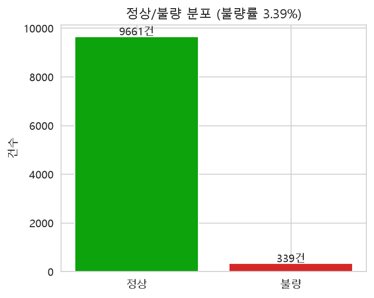
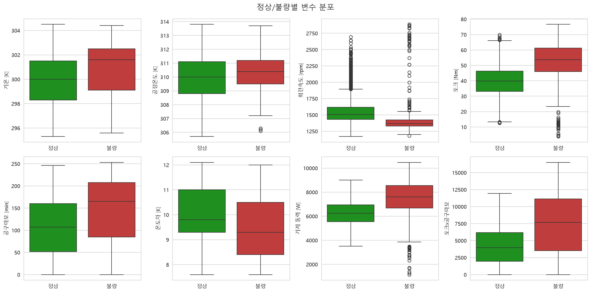
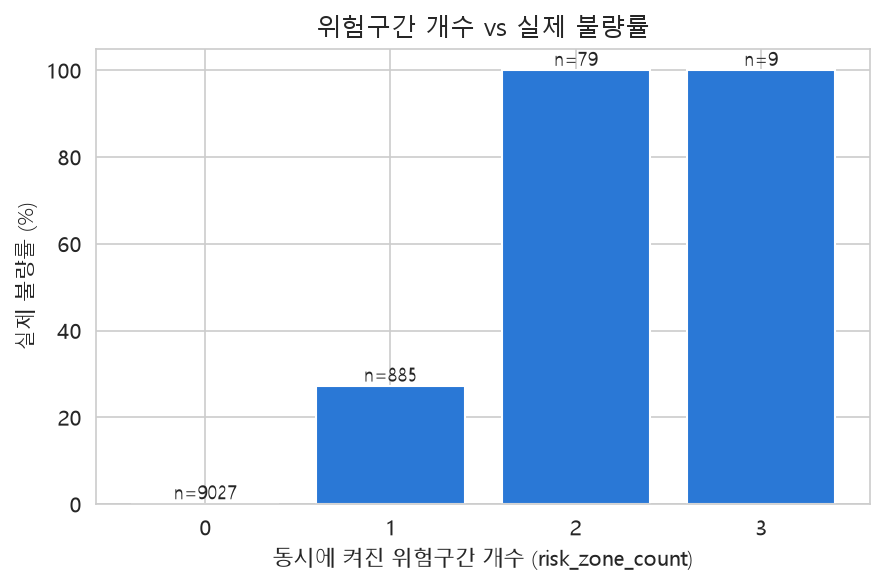
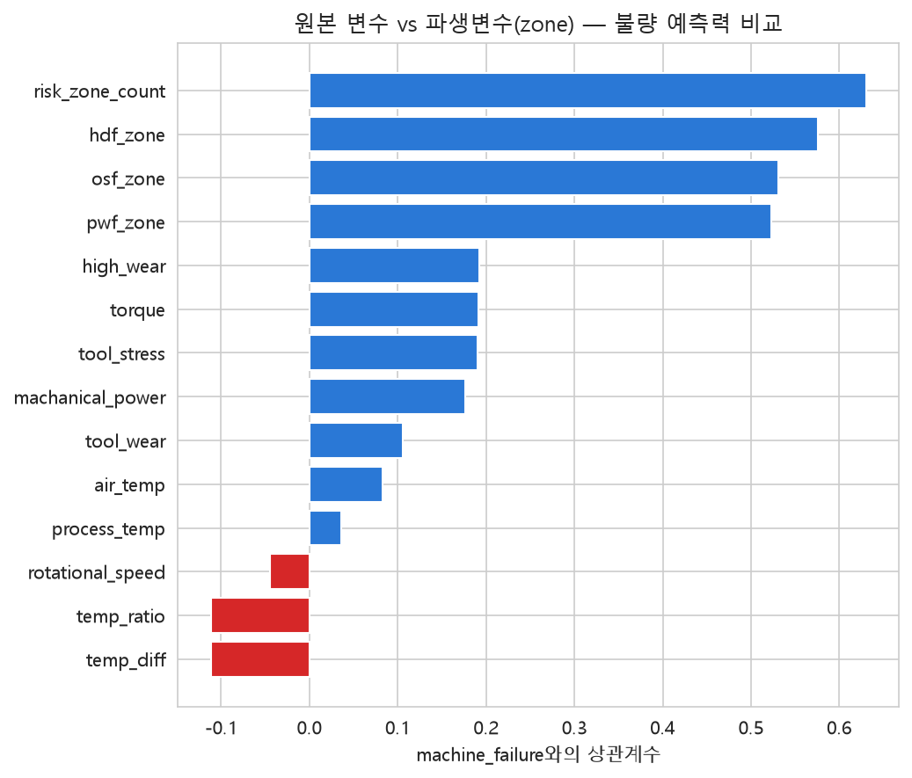
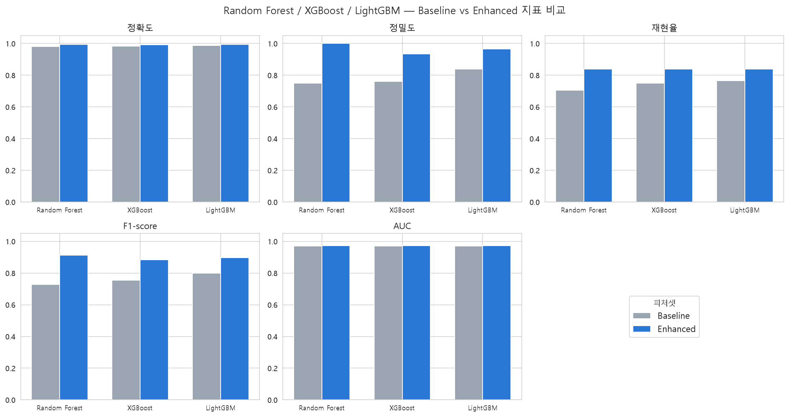
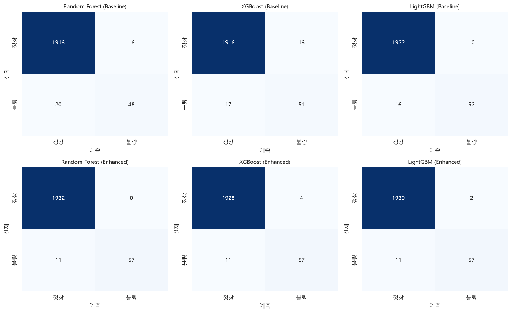

# 정상/불량(Machine failure) 이진분류 — EDA 및 피처 엔지니어링 정리

`src/modeling2.ipynb`에서 `Type`(L/M/H)이 아니라 `machine_failure`(0=정상, 1=불량)를 맞히는
**이진분류**로 목표를 바꿔 진행한 EDA와 피처 엔지니어링 과정을 정리한다. "왜 이렇게 했는지"와
"그래서 뭐가 좋아졌는지"를 실제 실행 결과(수치)로 기록한다.

## 1. 왜 이진분류인가

`classifications.ipynb`(Type 예측)는 파생변수를 추가해도 AUC가 0.48~0.51(랜덤 수준)에
머물렀다 — Type은 가동 중 측정값과 인과관계가 약한 식별자성 라벨이었기 때문이다. 반면
`Machine failure`는 `EDA.ipynb`에서 이미 `Torque`(0.19)·`Tool wear`(0.11)와 상관관계가 확인된
타겟이라, "정상/불량 판별"이라는 실제 설비진단 문제에 더 맞는 목표로 다시 잡았다.

## 2. EDA — 클래스 불균형과 변수 분포

정상 9,661건 vs 불량 339건(불량률 3.39%) — `EDA.ipynb`에서 확인한 것과 동일한 극심한 클래스
불균형이다. 그래서 accuracy만 보면 "전부 정상"이라고 찍어도 96% 넘게 나오므로, 이 프로젝트에서는
**불량(1) 클래스 기준 precision/recall/F1과 AUC를 기준 지표로 삼고**, 모델 학습 시
`class_weight="balanced"`를 적용했다.

정상/불량별 박스플롯을 보면 `torque`·`tool_stress`·`machanical_power`는 불량일 때 분포가 훨씬
넓게 퍼진다(과부하와 저부하 양쪽 극단에서 다 불량이 발생하기 때문). 반면 `air_temp`/
`process_temp` 자체는 정상/불량 차이가 작고, 대신 그 차이값(`temp_diff`)이 더 잘 갈린다 —
방열 고장(HDF) 판정 기준이 온도 자체가 아니라 온도"차"이기 때문이다. **원본 변수 하나하나보다
실제 고장 판정에 쓰이는 조합(차/곱/구간)이 더 좋은 신호**라는 결론을 여기서 얻었고, 이게 다음
피처 엔지니어링 방향을 정했다.

## 3. 피처 엔지니어링 — "위험구간(zone)" 플래그

AI4I 2020 데이터셋은 세부 고장 모드(HDF/PWF/OSF/TWF)가 원본 변수의 **임계값 규칙**으로
결정된다(공식 문서 기준). 원본 컬럼 `TWF`/`HDF`/`PWF`/`OSF`/`RNF`는 타겟과 사실상 동치라 이미
드롭했지만, 같은 판정 규칙을 원본 입력 변수(온도/회전속도/토크/공구마모/Type)만으로 **다시
계산**해서 피처로 추가하는 건 라벨을 직접 쓰는 게 아니므로 데이터 누수가 아니다.

| 피처 | 규칙 | 의미 |
| --- | --- | --- |
| `hdf_zone` | 온도차 < 8.6K **AND** 회전속도 < 1380rpm | 방열 고장 위험구간 |
| `pwf_zone` | 동력 < 3500W **OR** 동력 > 9000W | 전력 고장 위험구간 |
| `osf_zone` | 토크×공구마모 > Type별 임계값(L=11000/M=12000/H=13000) | 과부하 위험구간 |
| `high_wear` | 공구마모 > 200분 | TWF가 200~240분 사이 랜덤 발생하는 구간 직전 |
| `risk_zone_count` | 위 4개 합산(0~4) | 위험 신호가 동시에 몇 개 켜졌는가 |

`osf_zone`은 Type마다 임계값이 다르므로, `Type` 값의 앞뒤 공백(`' L   '` 형태)을 먼저
strip해야 `L`/`M`/`H`로 정확히 매핑된다 — 이번에 `modeling2.ipynb`에도 이 전처리를 추가했다.

> 위 임계값(8.6K, 1380rpm, 3500~9000W, 11000/12000/13000 minNm, 200~240분)의 출처는 이 저장소
> 파일이 아니라 [UCI Machine Learning Repository의 AI4I 2020 데이터셋 공식 설명 페이지](https://archive.ics.uci.edu/dataset/601/ai4i+2020+predictive+maintenance+dataset)다
> (발표 시 근거 자료로 인용 가능).

`risk_zone_count`별 실제 불량률: **0개 → 0.11%, 1개 → 27.23%, 2개 이상 → 100%**. 위험구간이
2개 이상 겹치면 사실상 무조건 불량이라는 뜻으로, 이 데이터셋의 정상/불량 라벨이 완전히 랜덤이
아니라 명확한 물리적 규칙을 따른다는 걸 재확인했다(`RNF`만 예외적으로 규칙 없는 순수 랜덤 고장).

`machine_failure`와의 상관계수(절댓값 기준)를 원본 변수와 나란히 비교하면:

| 변수 | 상관계수 |
| --- | --- |
| `risk_zone_count` | **0.630** |
| `hdf_zone` | 0.576 |
| `osf_zone` | 0.531 |
| `pwf_zone` | 0.523 |
| `high_wear` | 0.192 |
| `torque`(원본) | 0.191 |
| `tool_stress` | 0.190 |
| `machanical_power` | 0.176 |
| `tool_wear`(원본) | 0.105 |
| `air_temp`(원본) | 0.083 |

`risk_zone_count`가 원본 변수 중 가장 강한 `torque`(0.191)보다 3배 이상 높다 — "온도/회전속도/
토크 각각의 절대값"보다 "AI4I 2020이 정의한 고장 판정 규칙에 걸리는지 여부"가 훨씬 강한 신호였다.

## 4. 모델 비교 — Random Forest / XGBoost / LightGBM x Baseline / Enhanced

같은 두 피처셋(Baseline/Enhanced)에 트리 기반 모델 3종을 각각 학습시켜, **zone 피처 추가
효과가 모델 종류와 무관하게 재현되는지**까지 확인했다.

- **Baseline**: `Type`(원-핫) + `air_temp`/`process_temp`/`rotational_speed`/`torque`/`tool_wear`
- **Enhanced**: Baseline + `temp_diff`/`machanical_power`/`tool_stress` +
  `hdf_zone`/`pwf_zone`/`osf_zone`/`high_wear`/`risk_zone_count`
- 클래스 불균형(불량 3.39%) 보정: Random Forest/LightGBM은 `class_weight="balanced"`,
  XGBoost는 `scale_pos_weight`(음성/양성 비율)

| 모델 | 피처셋 | 정확도 | 정밀도 | 재현율 | F1-score | AUC |
| --- | --- | --- | --- | --- | --- | --- |
| Random Forest | Baseline | 0.982 | 0.750 | 0.706 | 0.727 | 0.970 |
| XGBoost | Baseline | 0.984 | 0.761 | 0.750 | 0.756 | 0.970 |
| LightGBM | Baseline | 0.987 | 0.839 | 0.765 | **0.800** | 0.971 |
| Random Forest | Enhanced | 0.994 | 1.000 | 0.838 | **0.912** | 0.973 |
| XGBoost | Enhanced | 0.992 | 0.934 | 0.838 | 0.884 | 0.973 |
| LightGBM | Enhanced | 0.994 | 0.966 | 0.838 | 0.898 | 0.974 |

(전부 불량(1) 클래스 기준 지표, `random_state=42`)

**zone 피처 효과는 모델 3종 전부에서 재현된다** — F1이 Random Forest +0.185, XGBoost +0.128,
LightGBM +0.098로 전부 올랐다. 다만 개선폭은 모델마다 다르다:

- **Baseline만 보면 LightGBM(F1 0.800)이 가장 좋다** — 그래디언트 부스팅 계열(LightGBM/XGBoost)이
  원본 변수만으로도 온도차×회전속도 AND 조건, Type별 임계값 같은 조합 규칙을 Random Forest보다
  더 잘 스스로 찾아낸다는 뜻이다. 반대로 이 조합 규칙을 상대적으로 못 찾던 Random Forest가 zone
  피처로부터 가장 크게 득을 봤다(개선폭 1위).
- **Enhanced에서는 오히려 Random Forest(F1 0.912)가 1위**다 — zone 피처가 조합 규칙을 이미
  계산해서 넣어준 상태라, 모델이 그 규칙을 스스로 재발견할 필요가 없어져서 세 모델 간 격차가
  좁혀졌다(F1 0.884~0.912).
- **재현율(0.838)은 Enhanced 3개 모델 전부 정확히 같다** — `risk_zone_count>=2`면 불량률
  100%인 규칙이 워낙 강해서, 어떤 모델을 쓰든 그 확실한 불량 샘플들은 똑같이 잡아낸다는 뜻이다.
  대신 정밀도는 RF(1.000) > LightGBM(0.966) > XGBoost(0.934)로 갈려서, 경계선 샘플 처리 방식만
  모델마다 차이가 났다.
- **AUC는 6개 조합 전부 0.970~0.974로 거의 차이가 없다** — Baseline 단계에서 이미 `torque`/
  `tool_wear`만으로도 순위를 잘 매기고 있었기 때문. zone 피처와 모델 종류 모두 "순위를 매기는
  능력(AUC)"보다는 "임계값 근처에서 정확히 가르는 능력(precision/recall/F1)"에 주로 기여했다.

## 5. 요약

1. `machine_failure` 자체가 세부 고장 모드(HDF/PWF/OSF)의 임계값 규칙으로 결정되는 타겟이라,
   그 규칙을 그대로 피처로 복원(`hdf_zone`/`pwf_zone`/`osf_zone`/`risk_zone_count`)하는 게
   가장 효과적인 피처 엔지니어링이었다.
2. 원본 변수 각각의 절대값보다, 실제 고장 판정에 쓰이는 "차이/곱/구간" 조합이 훨씬 강한 신호다.
3. 클래스 불균형(불량 3.39%)이 심한 문제에서는 AUC 하나만으로 개선폭을 판단하면 안 된다 —
   이번 사례처럼 AUC는 거의 그대로여도 F1/precision/recall은 크게 개선될 수 있다.
4. zone 피처 추가 효과는 Random Forest/XGBoost/LightGBM 3종 모두에서 재현된다 — 다만
   그래디언트 부스팅 계열(XGBoost/LightGBM)은 원본 변수만으로도 이미 그 조합 규칙을 어느 정도
   스스로 찾아내기 때문에, 상대적으로 약한 모델(Random Forest)일수록 zone 피처의 도움을 더
   크게 받는다.
5. 재현: 저장소 루트에서 `jupyter nbconvert --to notebook --execute --inplace src/modeling2.ipynb`
   (`lightgbm`/`xgboost` 설치 필요, `src/modeling2.ipynb` 참고, 랜덤성으로 재실행 시 수치가
   소폭 달라질 수 있음).
